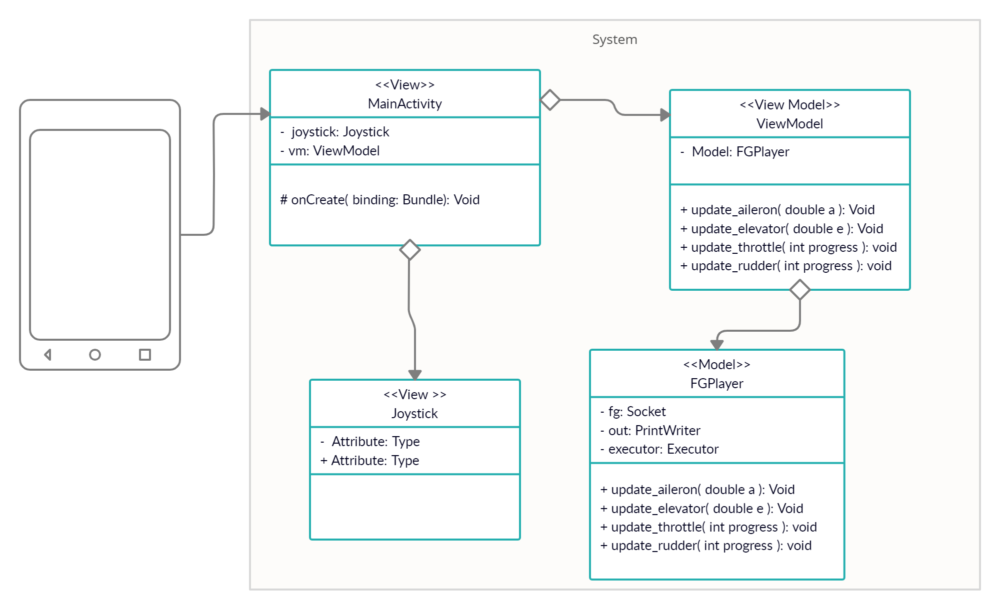

# Android Flight App
##### Advanced Programming 2 - Assignment 3


This Java script code is a web app for analyzing flights.
This web app connects to a server, and display in a graphic way information regarding the flight
Also, there is an option of choosing an anomaly detection algorithm to display the anomalies that were found during the flight.

## Application description and goal
Our users are flight researchers or pilots who want to learn from flight data.
The flight data includes the steering mode, speed, altitude direction, etc.
This app allows a user to upload to our server a training and flight data file. Then an anomaly detection algorithm learn the given info and detect anomalies found in the flight data file. The anomalies are displayed in the app in a list in which the user can see exactly where and when the anomaly has occurred.

## Prerequisites

- Download WebStrom/VS Code to run the server.
- Java Script- Node JS.
- Download all required packages with the command: "npm install".

## Getting Started

Clone the project via the command line:
```sh
git clone https://github.com/Gitit-Shapira/Web-App.git
```

Now, open the ```Server.js``` source file and run the code to open the server.

Now to use the app go to your favorite web browser and connect to the server with: localhost:8080:

A screenshot is attached:


Make sure to click the ```Submit``` button after uploading files and choosing algorithm setting.

## Features
- Choose Learn\Data file CSV - click on the ```Choose Learn File``` \ ```Choose Detect File```. You will be asked to upload a CSV file that contains the flight info (a CSV file in which flight data sampled at some rate is recorded).
- Choose an algorithm:- This allows you to select an anomaly detection algorithm. The algorithm will detect at what moments in time an anomaly occurred and will display it in a table
- You can use one of our demo CSV files: 
  1. https://github.com/Gitit-Shapira/Web-App/blob/main/Demo%20files/train.csv - file that containing the learning data.
  2. https://github.com/Gitit-Shapira/Web-App/blob/main/Demo%20files/test.csv - real Flight Data for anomalies detection. 

## Project Hierarchy

The main files in our project are as follow:

- Controller:
    - Server.js
    - buildTable.js
- Model:
    - Detector.js
    - TimeSeries.js
    - AnomalyTimeSteps.js
- View:
    - index.html - Display the app screen.

## More documentation
- UML:
app/src/main/res/Android App.png


## Demo video
https://www.youtube.com/watch?v=Ic3aTA65_wQ
## Writers
- Gitit Shapira
- Roey Peleg
- Linoy Sela
- Yair Yardeni


#

