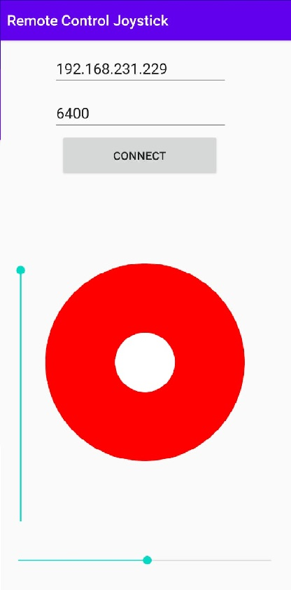
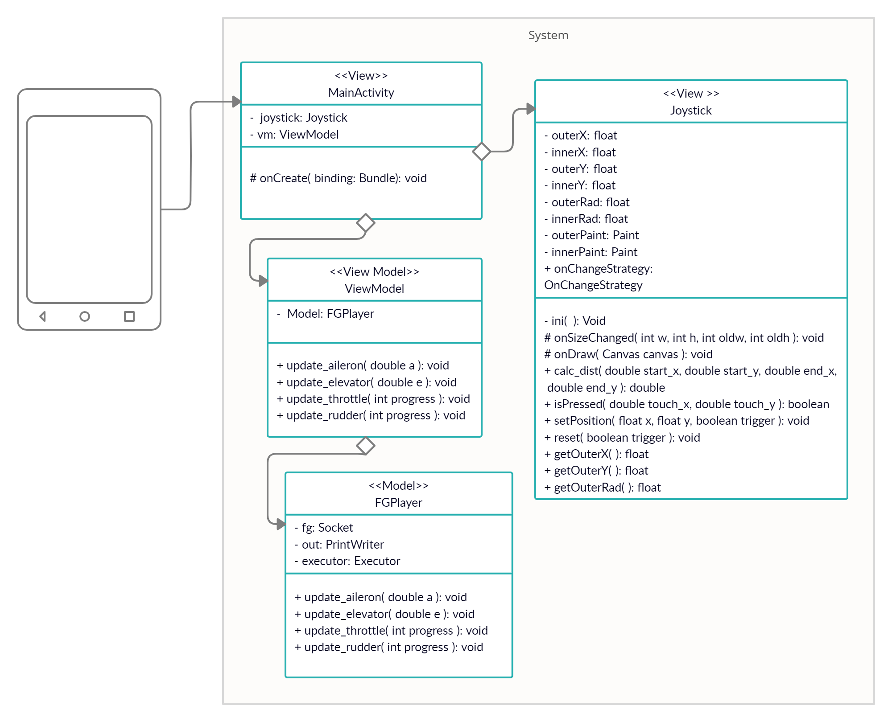

# Android Flight App
##### Advanced Programming 2 - Assignment 3


This Java script code is a Android app that let the user drive a plane.
This Android app connects to Flight-Gear server, and give you a joystick, Rudder and Throttle Sliders to control the plane.

## Application description and goal
Our users are flight researchers or pilots who want to do a test flight form anywhere using thier phone and a PC.

## Prerequisites
- Enable Developers setting and USB Debugging on your Android Phone.
- Download AndroidS/Clion to load this app onto your Android device.

## Getting Started
Clone the project via the command line:
```sh
git clone https://github.com/Waccsadac/Remote_Control_Joystick.git
```

Now, connect your Android device to your computer and load the app onto your device from your favorate IDE.

Now to use the app- connect to a computer which is currently running Flight Gear and is on the same network as your Android device, then enter this computer public IP and the currently open port on Flight Gear.

A screenshot is attached:



## Features
You will be asked to enter IP/Port to a computer the currently run Flight Gear.
- Connect to Flight Gear after entering IP/Port and click on Connect to start controlling the plane

## Project Hierarchy

The main files in our project are as follow:

- ViewModel:
    - ViewModel
- Model:
    - FGPlayer
- View:
    - Joystick
    - MainActivity

## More documentation
- UML:


## Demo video
https://youtu.be/V6h_VHExI3o

## Writers
- Gitit Shapira
- Roey Peleg


#

